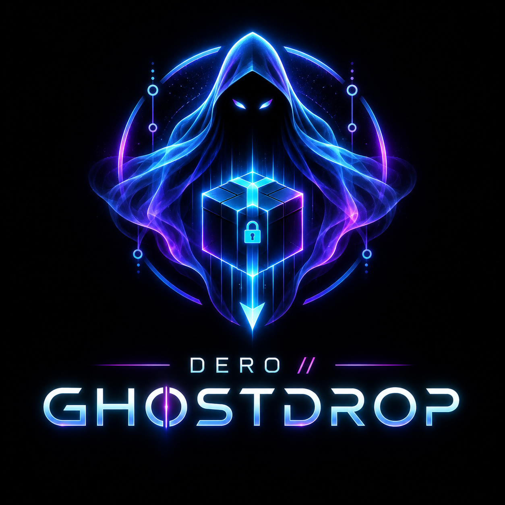

> **Project status: started, not finished.** This is an early-stage, working-prototype codebase — core flows (encrypt → store → retrieve → verify) run, but there is real work left (hardening, packaging, DERO mainnet integration, cross-platform testing). If you'd like to pick it up and contribute, feel free: open an issue, submit a PR, or fork it and run with it.

# GHOSTDROP V1 — privacy-first file transfer

**WHAT.** Ghostdrop sends files so that *nobody in the middle can read them*.
The sender's device encrypts every byte **before** anything leaves the machine.
The relay, the storage backend, and anyone watching the network only ever see
ciphertext, sizes, and timing — never filenames, contents, or keys.

* Privacy-first: encryption happens on-device, always. No plaintext uploads. Ever.
* No accounts, no analytics, no telemetry, no tracking pixels.
* Real crypto only: XChaCha20-Poly1305 + X25519 + Argon2id + Ed25519 + `crypto/rand`.
* One Go codebase for Windows 11, Linux (apt/dnf/yum/pacman/zypper), and macOS (brew).
* DERO is **optional**: anonymous free drops work with no wallet. DERO adds
  naming (`captain.dero`-style), identity signatures, and paid drops.

> Honest V1 scope: local encrypted drops + relay-mediated drops + CLI +
> desktop GUI + optional DERO naming/payment. No multi-hop anonymity network,
> no plausible-deniability steganography, no malware sandbox. See
> [KNOWN LIMITATIONS](docs/KNOWN_LIMITATIONS.md).

## HOW IT WORKS

```text
SENDER                                    RELAY / STORAGE                        RECIPIENT
──────                                    ───────────────                        ─────────
file ──► random 256-bit file key ──► SealFile ──► ciphertext ──► PUT /data ──► stored bytes
              │        │                        (1 MiB chunks,                  (relay sees
              │        │                         XChaCha20-Poly1305)             ciphertext only)
              │        ▼
              │   lock file key to recipient (X25519 WrapFileKey)
              │   OR derive from passphrase (Argon2id)
              ▼
manifest (JSON): drop_id, hashes, sizes, wrapped_key / salt, expiry, signature
              │
              └──► link: ghostdrop://drop/<id> (+ key or password out-of-band)
                                                                        │
recipient: GET /data ──► UnwrapFileKey ──► OpenFile ──► hash check ──► file ◄─┘
```

1. **Key.** A fresh 256-bit file key is generated per drop (`crypto.GenerateFileKey`).
   It is locked to the recipient's X25519 public key (`WrapFileKey`) or derived
   from a passphrase with Argon2id (`DeriveKeyFromPassphrase`). The raw key is
   never stored, logged, or transmitted.
2. **Encrypt.** `SealFile` streams the plaintext in **1 MiB chunks** and writes
   `GD01 || headerNonce(24B) || { BE32 len || sealed }*`. Chunk nonce =
   `headerNonce xor BE64(index)` in the last 8 bytes. Memory stays flat
   regardless of file size; a 1 GiB file never loads into RAM.
3. **Move.** Ciphertext uploads to the relay (`PUT /api/v1/drops/{id}/data`,
   resumable via `Content-Range`) or sits in local storage. Filenames are
   encrypted into the manifest (`EncryptFilenames`).
4. **Retrieve.** The recipient fetches ciphertext (resumable via `Range`),
   unwraps the file key, decrypts, and verifies SHA-256 of the plaintext.
   Wrong key or a single flipped byte → hard failure, no partial output kept.
5. **Expire / revoke.** Drops carry `expires_at` and `one_time`. Expiry is
   enforced server-side; revoke deletes ciphertext + manifest.

## QUICK START

```sh
# 0. prerequisites
bash scripts/setup.sh          # Windows: powershell -NoProfile -File scripts/setup.ps1

# 1. build
bash scripts/build.sh          # binaries land in bin/

# 2. run a relay (terminal 1)
./bin/ghostdrop-relay start --listen 127.0.0.1:8080

# 3. send a file (terminal 2) — anonymous, no DERO needed
./bin/ghostdrop-cli send ./photo.jpg --relay http://127.0.0.1:8080 --expire 24h
# → ghostdrop://drop/GD-A1B2C3D4E5F6  (+ one-time key shown once)

# 4. receive (terminal 3)
./bin/ghostdrop-cli receive 'ghostdrop://drop/GD-A1B2C3D4E5F6' --out ./inbox/

# 5. password instead of recipient key
./bin/ghostdrop-cli send ./photo.jpg --password --expire 1h

# 6. desktop GUI
./bin/ghostdrop --open-url 'ghostdrop://drop/GD-A1B2C3D4E5F6'
```

First-run `doctor` (checks relay reachability, wallet/daemon status, disk space):

```sh
./bin/ghostdrop-cli doctor
./bin/ghostdrop-cli status
```

## SECURITY

* **Algorithms.** XChaCha20-Poly1305 (files + wrap), X25519 (recipient lock),
  Argon2id 64 MiB / 3 iterations (passphrases), Ed25519 (manifest signatures),
  `crypto/rand` everywhere. No custom ciphers, no ECB, no homebrew KDF.
* **Streaming.** Encryption, hashing, upload, and download are chunked; whole
  files are never buffered.
* **Memory hygiene.** Key material is `Wipe`d (zeroed) after use. Keys, seeds,
  and tokens are never written to logs — the relay logs IDs, sizes, and status
  codes only.
* **Fail closed.** Tamper, wrong key, wrong passphrase, expired drop, unknown
  recipient: the operation abibil fails and partial plaintext is discarded.
* Full model: [docs/THREAT_MODEL.md](docs/THREAT_MODEL.md) (attackers,
  PROTECTS vs DOES-NOT-PROTECT). Component visibility:
  [docs/PRIVACY.md](docs/PRIVACY.md).

## PRIVACY

| Component | Sees plaintext? | Sees filenames? | Sees keys? | Sees |
|---|---|---|---|---|
| Sender device | **yes** (its own files) | yes | yes (in RAM only) | everything, locally |
| Relay / storage | **no** — ciphertext only | **no** (encrypted in manifest) | **no** | size, timing, drop id, expiry |
| Network observer | **no** | **no** | **no** | sizes, timing, endpoints |
| Recipient (post-auth) | yes (after unwrap) | yes (after decrypt) | file key only | its own drops |
| DERO network | **no file data** | no | no | only intentional txs (names/payments) |

Details: [docs/PRIVACY.md](docs/PRIVACY.md).

## DERO (optional)

Ghostdrop works with **no DERO at all**. When you want it:

* **Names.** `dero.ResolveName(ctx, "captain.dero")` → address (verified flag).
  `dero1q…` addresses pass through. Offline → `ErrOffline`, never a guess.
* **Addresses.** `dero.ValidateAddress` gates every send/request.
* **Identity.** Optional Ed25519 sender signatures on manifests
  (`crypto.Sign/Verify`, `manifest.Sign/Verify`); wallet signing via
  `dero.SignWithWallet` when a wallet endpoint is configured.
* **Paid drops.** `dero.CheckPayment(ctx, daemon, txid, address, minAmount)`
  gates retrieval for `--price` / `--paid-to` drops. No wallet connected?
  Paid flows are simply unavailable; free flows unaffected.

## IDENTITY

* Per-drop sender identity: `manifest.sender_identity` + `signature{by,pub,sig}`.
* Recipient binding: `recipient_commitment` + X25519 `access.wrapped_key` /
  `access.ephem_pub`, or `access.passphrase_salt` + `kdf` for password drops.
* Anonymous mode (`--anonymous`) sends with no identity fields at all.

## STORAGE

`storage.Provider` interface (`Put/Get/Delete/Exists/Stat/Health`,
`Backend()` name; errors `ErrNotFound/ErrExpired/ErrQuota`). V1 ships a
filesystem backend (OS-native paths via `platform.ConfigDir/DataDir/DownloadDir`)
fronted by the relay's HTTP API. `Get` supports `offset` for resume; nothing
outside the interface touches disk layout, so new backends slot in cleanly.

## RELAY

`net/http` ServeMux, no framework:

| Method & path | Purpose |
|---|---|
| `POST /api/v1/drops` `{id,size_bytes,expiry_rfc3339,one_time}` → `{ok}` | register |
| `PUT /api/v1/drops/{id}/data` octet-stream, `Content-Range: bytes off-end/total`, `X-Ghostdrop-Token` | upload / resume |
| `GET /api/v1/drops/{id}/data` (`Range: bytes=off-`), `X-Ghostdrop-Token` | download / resume |
| `GET /api/v1/drops/{id}/meta` | metadata |
| `DELETE /api/v1/drops/{id}` | revoke |
| `GET /api/v1/health`, `GET /api/v1/stats` | ops |

The server never logs content or keys. `ghostdrop-relay start|status|config|stats`.

## CLI

```sh
ghostdrop-cli send <paths...> [--to <name|addr>] [--expire 24h] [--anonymous]
  [--password] [--price <amount>] [--paid-to <addr>] [--relay URL] [--one-time]
ghostdrop-cli receive <ghostdrop://drop/<id>> [--out DIR] [--password ...]
ghostdrop-cli inspect <id> | verify <id> | revoke <id> | list | status | doctor
```

`ghostdrop --demo` runs a guided demo; `--open-url ghostdrop://drop/<id>`
jumps straight to receive. The desktop app (`cmd/ghostdrop`) serves the local
`web/` UI, opens the browser, supports tray-less ghost mode (no persist), QR
share via `go-qrcode`, and clipboard copy.

## BUILDING

```sh
bash scripts/setup.sh && bash scripts/build.sh && bash scripts/test.sh
# Windows (PowerShell):
powershell -NoProfile -File scripts/setup.ps1
powershell -NoProfile -File scripts/build.ps1
powershell -NoProfile -File scripts/test.ps1
```

* Requires **Go ≥ 1.24**. `go mod tidy` may add only: `github.com/google/uuid`,
  `github.com/skip2/go-qrcode`, `golang.org/x/crypto`, `modernc.org/sqlite`
  (pure Go, no cgo). Stdlib otherwise.
* Big-file integration proof: `GHOSTDROP_BIG=1 go test ./tests/ -run 'Integration|Acceptance' -count=1`
  (1 GiB instead of the default 64 MiB).
* Packaging: `bash scripts/package.sh` (zip/tar.gz; notes for .deb/.rpm,
  AppImage, PKGBUILD, .dmg inside). See [packaging.yml](packaging.yml).

## PLATFORMS

| OS | Config | Data | Notes |
|---|---|---|---|
| Windows 11 | `%AppData%\Ghostdrop` | `%LocalAppData%\Ghostdrop` | `.exe` binaries; `setup.ps1` via winget hints |
| Linux | `~/.config/ghostdrop` | `~/.local/share/ghostdrop` | `setup.sh` handles apt/dnf/yum/pacman/zypper |
| macOS | `~/Library/Application Support/Ghostdrop` | same | `setup.sh` via brew |

All OS paths sit behind `internal/platform` adapters; `GHOSTDROP_*` env vars
override (`config.Load`). Downloads default to the OS download dir.

## THREAT MODEL (excerpt)

Attackers considered: malicious sender, malicious recipient, malicious relay,
malicious storage, passive network observer, compromised DERO node/wallet,
stolen link, malicious file, traffic-correlation analyst, local-device thief.
**Protects:** file/index confidentiality + integrity against relay, storage,
and observers; authenticity via signatures; forward-safe per-drop keys.
**Does not:** hide sizes/timing, sandbox malicious files, survive endpoint
compromise, or resist global traffic correlation. Full text:
[docs/THREAT_MODEL.md](docs/THREAT_MODEL.md).

## KNOWN LIMITATIONS

* Sizes and timing are visible to relay/observers (no padding/mixing in V1).
* Relay is trusted for availability + expiry enforcement, never for secrecy.
* Password drops live or die by passphrase strength (Argon2id slows, not saves,
  `password123`).
* No file-type sandboxing: received files are bytes; open them with care.
* DERO features degrade to clear errors offline — never silent fallbacks.
* Full list: [docs/KNOWN_LIMITATIONS.md](docs/KNOWN_LIMITATIONS.md).

## ROADMAP

* V1 ✅: encrypted drops, relay + resume, CLI + desktop, optional DERO.
* Next: relay federation + sharding, at-rest relay encryption with forward
  secrecy rotation, streaming desktop previews, hardware-wallet signing,
  signed relay transparency log, Tor/SOCKS transport option.
* Out of scope by design: analytics of any kind, account systems, plaintext
  modes, Electron.
